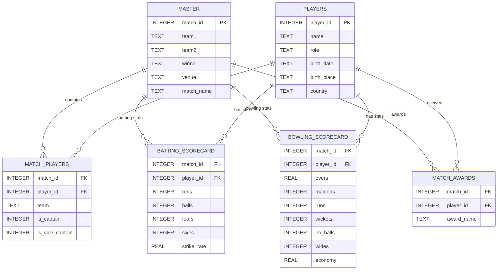

# Cricbuzz Data Warehouse

A comprehensive Python-based scraping toolkit to build a relational database (`cricbuzz.db`) of cricket matches, players, scorecards, and awards from Cricbuzz.

## 📌 Features

*   **Relational Database**: Normalized SQLite Schema (V2) with connected tables.
*   **Comprehensive Data**:
    *   **Matches**: Series names, venues, results.
    *   **Players**: Full profiles including DOB, Birthplace, and Country.
    *   **Scorecards**: Detailed Batting (Runs, Balls, 4s, 6s) and Bowling (Overs, Maidens, Wickets, Economy) stats.
    *   **Squads & Roles**: Tracks playing XIs and Captains/Vice-Captains.
    *   **Awards**: "Player of the Match" tracking.

## 🛠️ Setup

1.  **Prerequisites**: Python 3.x
2.  **Dependencies**:
    ```bash
    pip install -r requirements.txt
    ```
    *(Requires `requests` and `beautifulsoup4`)*

## 🚀 Usage

Run the scripts in the following order to populate the database:

1.  **Initialize & Fetch Matches**:
    ```bash
    python3 sports_records.py
    ```
    *Creates `master` table and fetches basic match info.*

2.  **Fetch Squads & Players**:
    ```bash
    python3 squads.py
    ```
    *Populates `players` and `match_players` tables.*

3.  **Fetch Scorecards**:
    ```bash
    python3 scorecard.py
    ```
    *Populates `batting_scorecard` and `bowling_scorecard`.*

4.  **Enrich Player Data**:
    ```bash
    python3 enrich_players.py
    ```
    *Adds details like DOB and Country to `players`.*

5.  **Identify Captains**:
    ```bash
    python3 extract_captains.py
    ```
    *Updates `match_players` with `is_captain` flag.*

6.  **Fetch Awards**:
    ```bash
    python3 awards.py
    ```
    *Populates `match_awards`.*

## 🗄️ Database Schema (V2)



You can also visualize the schema by opening **`schema_viewer.html`** in your browser.

*   **`master`**: Central match registry (`match_id`, `team1`, `team2`, `winner`, `venue`, `match_name`).
*   **`players`**: Player profiles (`player_id`, `name`, `role`, `birth_date`, `country`).
*   **`match_players`**: Junction table linking Players to Matches (`team`, `is_captain`).
*   **`batting_scorecard`**: Batting stats per match.
*   **`bowling_scorecard`**: Bowling stats per match.
*   **`match_awards`**: Match awards.

## 🧹 Maintenance Scripts

*   `migrate_v2.py`: Migrates database from V1 to V2 schema.
*   `cleanup_v2.py`: Removes legacy tables after migration.
*   `clean_names.py`: Utility to sanitise player names.
